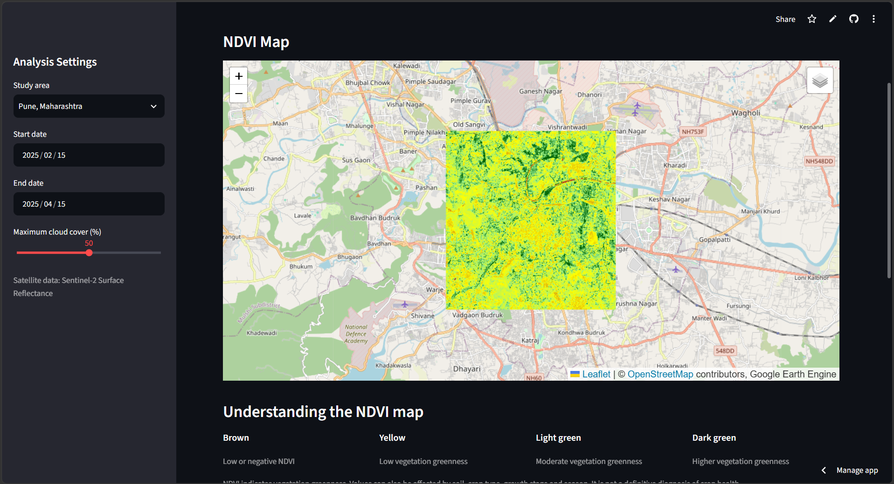
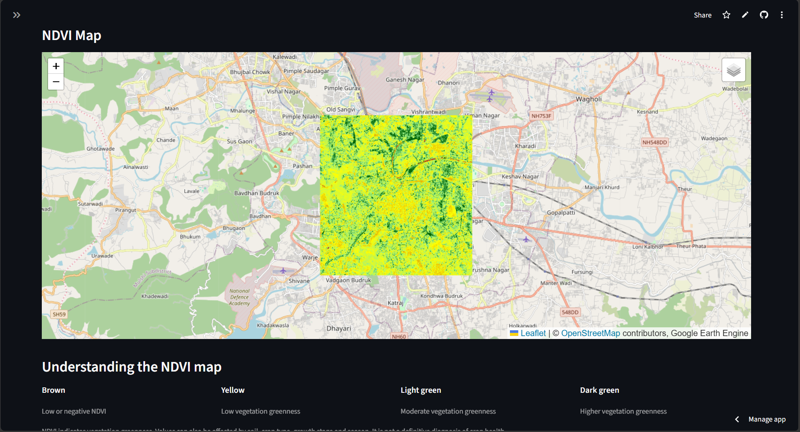
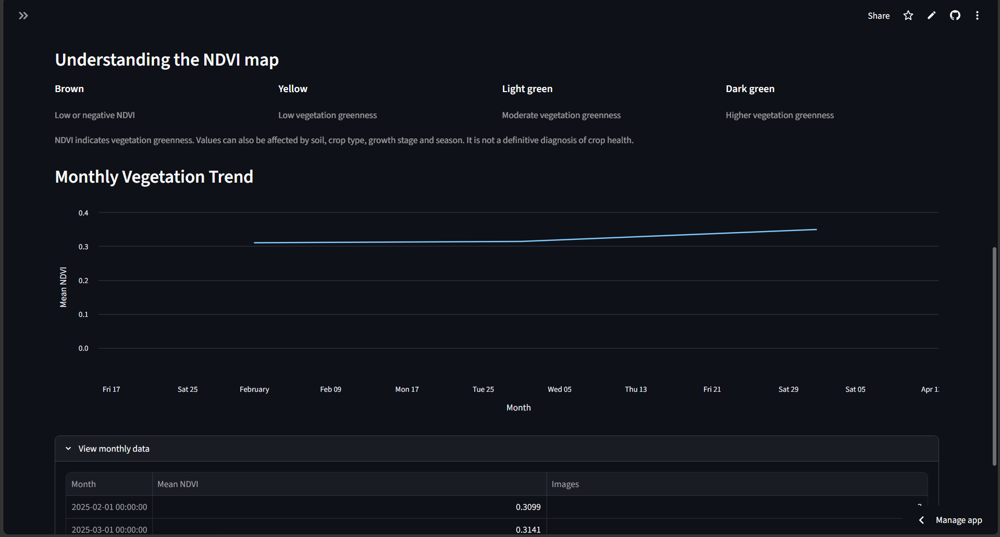
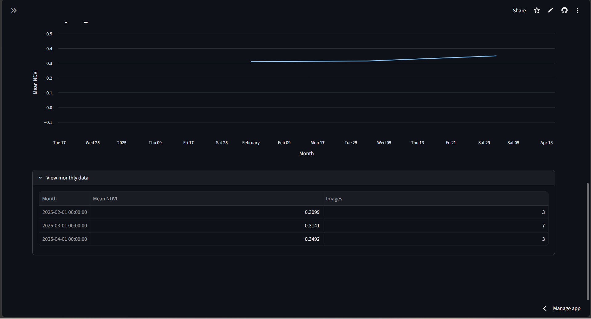

# 🌱 Satellite-Based Crop Health Monitoring Using NDVI

An interactive web application for exploring vegetation conditions using Sentinel-2 satellite imagery and the Normalized Difference Vegetation Index (NDVI). Built with Python, Google Earth Engine, and Streamlit.

## 🚀 Live Demo

**[Open the Satellite Crop Monitor](https://satellite-crop-monitor.streamlit.app/)**


## 🖥️ Dashboard Preview

### Dashboard Overview


### Interactive NDVI Map


### Monthly NDVI Trend


### Monthly NDVI Data


### Monthly Vegetation Trend


## 📌 Project Overview

This project uses satellite-derived vegetation indices to visualize vegetation greenness across selected study areas. Users can select a location, choose a date range, adjust the maximum cloud-cover threshold, and explore NDVI maps and monthly trends.

## ✨ Features

- **Interactive dashboard:** Select a study area and analysis period.
- **Satellite data processing:** Retrieve Sentinel-2 Surface Reflectance imagery through Google Earth Engine.
- **NDVI calculation:** Calculate NDVI using near-infrared (B8) and red (B4) bands.
- **Interactive NDVI map:** Visualize vegetation greenness with a color-coded map.
- **Monthly trend analysis:** View monthly mean NDVI and the number of matching satellite images.
- **Cloud-cover filtering:** Set a maximum cloud-cover threshold for imagery selection.

## 🛠️ Technology Stack

- **Language:** Python
- **Dashboard:** Streamlit
- **Satellite data and processing:** Google Earth Engine, Sentinel-2
- **Interactive mapping:** Folium, Streamlit-Folium
- **Data handling:** Pandas
- **Version control:** Git and GitHub
- **Deployment:** Streamlit Community Cloud

## 📊 Understanding NDVI

NDVI (Normalized Difference Vegetation Index) is calculated as:

\[
NDVI = \frac{NIR - Red}{NIR + Red}
\]

For Sentinel-2 imagery, this project uses:

- **NIR:** Band 8 (B8)
- **Red:** Band 4 (B4)

Higher positive values generally indicate greener vegetation, while low or negative values may indicate sparse vegetation, bare surfaces, water, or other non-vegetated areas.

NDVI alone does not provide a definitive diagnosis of crop health. Values can vary with crop type, season, growth stage, soil, and other land-cover characteristics.

## ⚙️ Run Locally

### 1. Clone the repository

```bash
git clone https://github.com/Juhi-Bhamare/satellite-crop-monitor.git
cd satellite-crop-monitor
```

### 2. Create and activate a virtual environment

**Windows PowerShell:**

```powershell
python -m venv .venv
.\.venv\Scripts\Activate.ps1
```

### 3. Install dependencies

```bash
pip install -r requirements.txt
```

### 4. Configure Google Earth Engine

Sign in with a Google account that has access to Earth Engine and configure the project used by the application. See the [Google Earth Engine documentation](https://developers.google.com/earth-engine/guides).

For local development, authenticate with Earth Engine as required by your environment.

### 5. Start the dashboard

```bash
python -m streamlit run app.py
```

The application will open in your browser.

## 🗺️ Study Area Notes

The current study areas are approximate city-centred geographic rectangles. They may include urban land, water, bare surfaces, and vegetation. Results should therefore be interpreted as regional vegetation indicators rather than measurements for specific agricultural fields.

## 🔮 Potential Future Improvements

- Add agricultural-field boundary selection.
- Integrate cloud and shadow masking at the pixel level.
- Compare vegetation trends across multiple seasons.
- Add exportable NDVI summaries and charts.
- Explore additional vegetation indices.

## 👩‍💻 Author

**Juhi Bhamare**

- GitHub: [Juhi-Bhamare](https://github.com/Juhi-Bhamare)

## 📄 Data Source

Sentinel-2 Surface Reflectance Harmonized collection via [Google Earth Engine](https://earthengine.google.com/).